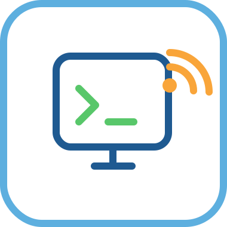

# Clily Terminal Viewer

<p align="center">
  
</p>

[](https://github.com/namjoo-kim-gachon/clily/actions/workflows/build.yml)
[](https://github.com/namjoo-kim-gachon/clily/actions/workflows/test.yml)
[](https://www.npmjs.com/package/@namjookim/clily)
[](./LICENSE)

Use your browser as a mobile-friendly terminal client while keeping terminal sessions alive on the server.

Sessions are backed by [shpool](https://github.com/shell-pool/shpool), so they survive server restarts and can be attached from any other terminal client.

## What You Can Do

- Keep terminal sessions alive even across server restarts (via shpool).
- Attach to the same session from any terminal with `shpool attach clily-1`.
- Open multiple terminal sessions and switch between them.
- Send normal commands and shortcut sequences from the same UI.
- Restore recent terminal output after reconnect.
- Use swipe navigation on mobile and button navigation on desktop.
- Install as a PWA (standalone app experience) on supported browsers.
- Receive browser notifications when terminal output stays idle for 30 seconds.

## Installation

```bash
npm install -g @namjookim/clily
```

After installation, the `clily` shell function is automatically added to your `.zshrc` / `.bashrc`. Restart your terminal or run:

```bash
source ~/.zshrc  # or ~/.bashrc
```

### Run the server

```bash
clily
```

Open `http://localhost:3000` in your browser. Set a custom port with the `PORT` environment variable:

```bash
PORT=8080 clily
```

### Open a file in the editor panel

From your terminal, pass a file path to the `clily` shell function:

```bash
clily ./src/app/page.tsx
```

This sends the file path to the clily editor panel via OSC sequence, opening it instantly in the browser.

## Core Usage Flow

1. Open the app and wait for the terminal view to load.
2. Type a command in the command input and press Enter.
3. Use **+** to create a new terminal session.
4. Switch sessions:
   - Mobile: swipe left/right on the terminal area.
   - Desktop: use previous/next buttons.
   - The header shows the current session name, e.g. `Session[clily-1] 1 / 2`.
5. For shortcut input (for example `Ctrl+B D`), use the shortcut field and submit.
6. If you reload or reconnect, the app restores all existing shpool sessions automatically.
7. From any other terminal, attach to the same session with:
   ```bash
   shpool attach clily-1
   ```


## Troubleshooting

### Terminal does not start or shows runtime failure

This usually means shpool is not installed or the daemon failed to start.

Try:

- Verifying shpool is installed: `which shpool`
- Starting the daemon manually: `shpool daemon`
- Running from a local terminal session (not SSH without a TTY).
- Verifying shell availability and permissions on macOS/Linux.

### shpool is not installed

If shpool is unavailable, the app falls back to direct PTY sessions (no persistence across server restarts).


## FAQ

### Does this create a new terminal every time I reconnect?

No. Sessions persist across browser reconnects and server restarts. When the server starts, it automatically reconnects to any existing shpool sessions named `clily-N`.

### Can I use multiple terminals?

Yes. Create additional sessions with the **+** button and switch between them.

### Which shortcut inputs are supported?

You can send key-like expressions such as `Ctrl+B`, `Shift+Tab`, arrow keys, `Esc`, and more through the shortcut input flow.

### Can I access the same session from iTerm2 or Terminal.app?

Yes. Since sessions are backed by shpool, you can attach from any terminal:

```bash
shpool attach clily-1
```

### Does it support PWA install?

Yes. The app includes a web manifest (`/manifest.webmanifest`) and registers a service worker (`/sw.js`) so you can install it as a standalone app on supported browsers.

### How do idle notifications work?

The app requests browser notification permission and sends a notification when the active terminal view has no visible changes for 30 seconds. Identical idle states are deduplicated to avoid repeated alerts.

## For Contributors

### Setup

```bash
npm install
```

Install shpool (required for terminal sessions):

```bash
# macOS
brew install shpool

# or via cargo
cargo install shpool
```

```bash
npm run dev
```

> The shpool daemon starts automatically on first use. Sessions are named `clily-1`, `clily-2`, etc.

### Quality checks

- Run quality checks:

```bash
npm run lint
npm run typecheck
npm test
```

- Run E2E tests:

```bash
npm run test:e2e
```

- Optional UI mode:

```bash
npm run test:e2e:ui
```
